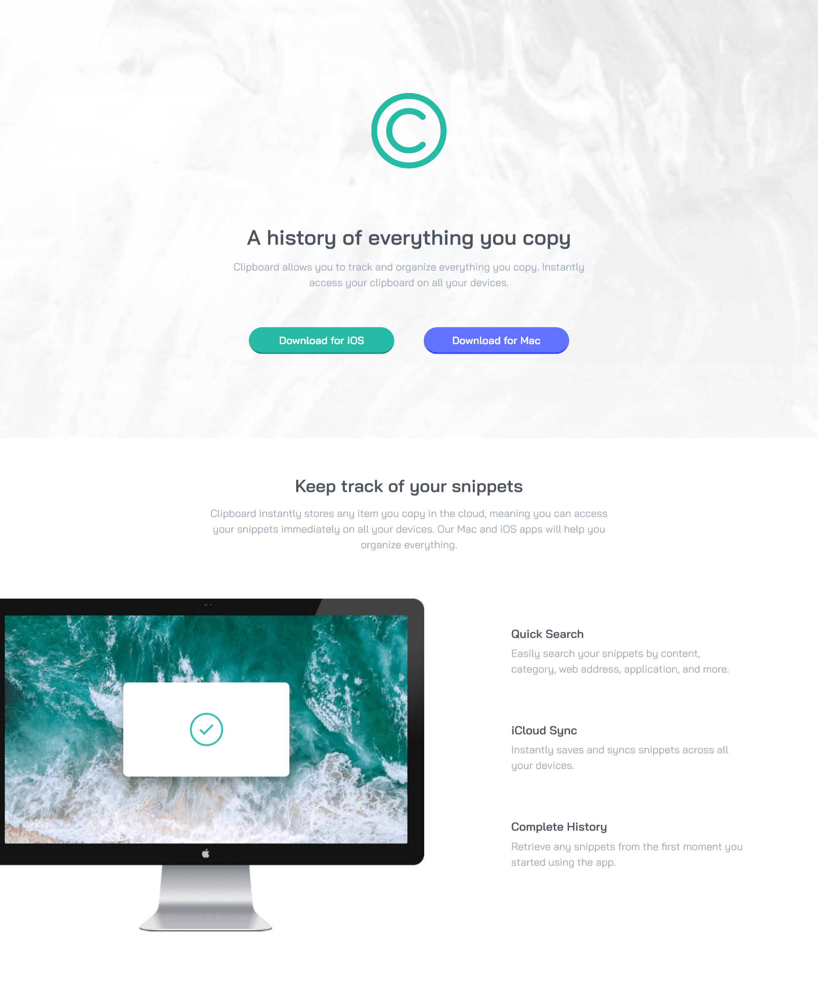
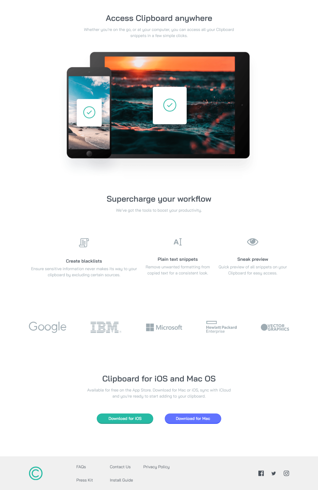
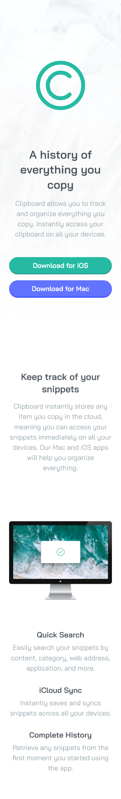
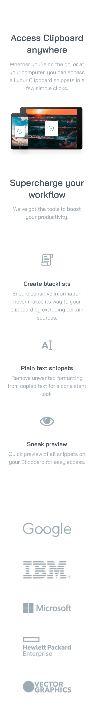
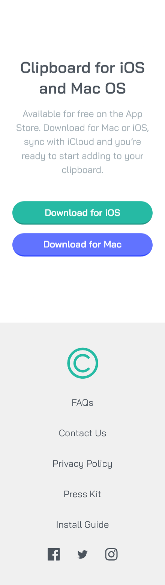

# Frontend Mentor - Clipboard landing page solution

This is a solution to the [Clipboard landing page challenge on Frontend Mentor](https://www.frontendmentor.io/challenges/clipboard-landing-page-5cc9bccd6c4c91111378ecb9). Frontend Mentor challenges help you improve your coding skills by building realistic projects. 

## Table of contents

- [Frontend Mentor - Clipboard landing page solution](#frontend-mentor---clipboard-landing-page-solution)
  - [Table of contents](#table-of-contents)
  - [Overview](#overview)
    - [The challenge](#the-challenge)
    - [Screenshot](#screenshot)
    - [Links](#links)
  - [My process](#my-process)
    - [Built with](#built-with)
    - [What I learned](#what-i-learned)
    - [Useful resources](#useful-resources)
  - [Author](#author)
  - [Acknowledgments](#acknowledgments)

**Note: Delete this note and update the table of contents based on what sections you keep.**

## Overview

### The challenge

Users should be able to:

- View the optimal layout for the site depending on their device's screen size
- See hover states for all interactive elements on the page

### Screenshot
**Desktop**

**Mobile**

### Links

- Solution URL: [Github](https://github.com/gylim0604/FrontEnd-Mentor-Clipboard-landing-page)
- Live Site URL: [Vercel](https://front-end-mentor-clipboard-landing-page.vercel.app/)

## My process

### Built with

- [Next.js](https://nextjs.org/) - React framework
- [Chakra-UI](https://chakra-ui.com/) - React component library
- Mobile-first workflow
- Flexbox
- CSS Grid

### What I learned

Overall was a shorter one, didn't get too detail about stuff, just wanted a quick thing done. 

- Learnt abit about how the hsl color scheme works. Was useful when I wanted to darken colors.
- Found two really useful hooks in Chakra UI,  [useToken](https://chakra-ui.com/docs/hooks/use-token) and [useMediaQuery](https://chakra-ui.com/docs/hooks/use-media-query). **useMediaQuery** enabled me to do css-esque media query stuff with js, while **useToken** was just useful to get different shades of colors and pass them into jsx.

### Useful resources

- [The Software House](https://tsh.io/blog/why-should-you-use-hsl-color-representation-in-css/) - Really quick read on HSL and how they work. 

## Author

- Frontend Mentor - [@gylim0604](https://www.frontendmentor.io/profile/gylim0604)
  
## Acknowledgments